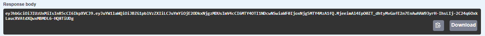
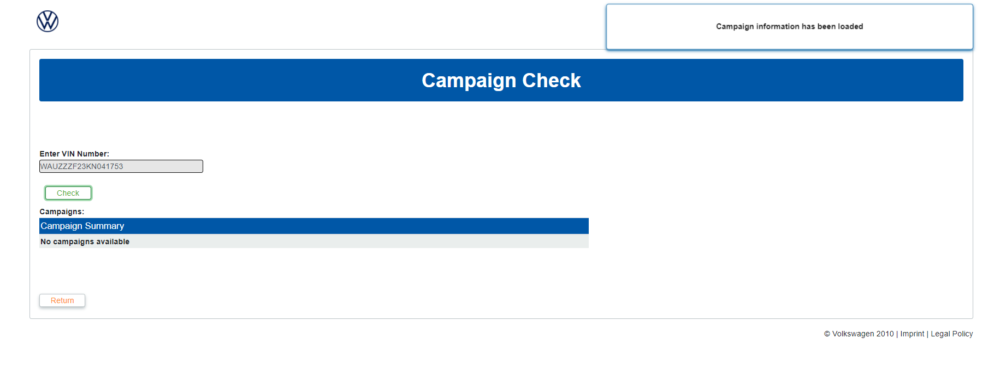
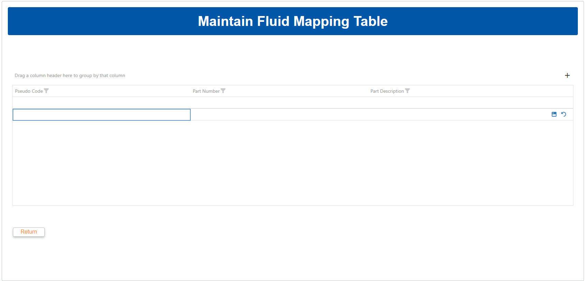

**VWSA**

***PPSO for Special Markets***

***User Manual***

***Version 1.1.1***

Confidentiality and Copyright

Proprietary, confidential data. All rights reserved.

Distribution and/or reproduction of these documents or any of their
parts, their utilisation or communication of their contents to third
parties is not allowed, unless formally conceded. Contravention will
cause damages.

Copyright © 2019 by S4 Integration (Pty) Ltd.

S4 Integration (Pty) Ltd.

1 Leadwood Crescent

Fairview

Port Elizabeth

South Africa

6065

[www.s4.co.za](http://www.s4.co.za)

**  
**

**Table of Contents**

[Confidentiality and Copyright 2](#_Toc484093250)

[1 Document Information 7](#document-information)

[1.1 Change History 7](#change-history)

[2 Introduction 8](#introduction)

[3 Web application usage 9](#web-application-usage)

[3.1 Loading Screen 9](#loading-screen)

[3.2 Navigation for Users 10](#navigation-for-users)

[3.3 Total Cost of Servicing 11](#total-cost-of-servicing)

[3.4 Navigation for Admin users 14](#navigation-for-admin-users)

[3.5 Maintain Model Reference VIN Number
15](#maintain-model-reference-vin-number)

[3.6 Maintain Service Data for Model
17](#maintain-service-data-for-model)

[3.7 Delete Service Data for Model 21](#delete-service-data-for-model)

[3.8 View Packages 23](#view-packages)

[3.9 Vehicle Service History 26](#vehicle-service-history)

[3.10 Campaign Check 27](#campaign-check)

[3.11 Part Look Up 29](#part-look-up)

[3.12 Crafter Service Intervals 30](#crafter-service-intervals)

[3.12.1 Adding a new Service Interval
30](#adding-a-new-service-interval)

[3.12.2 Editing an existing Entry 32](#editing-an-existing-entry)

[3.12.3 Deleting an entry 32](#deleting-an-entry)

[3.12.4 Grid features 33](#grid-features)

[3.13 Fluid Mapping 34](#fluid-mapping)

[3.13.1 Adding a new Fluid Mapping 34](#adding-a-new-fluid-mapping)

[3.13.2 Editing an existing Entry 36](#editing-an-existing-entry-1)

[3.13.3 Deleting an entry 36](#deleting-an-entry-1)

[3.13.4 Grid Features 37](#grid-features-1)

[3.14 Usage Reports 37](#usage-reports)

[3.15 Manual Data Maintenance 38](#manual-data-maintenance)

[4 Weekly Task Scheduler 41](#weekly-task-scheduler)

[4.1 Models Flat File 41](#models-flat-file)

[4.2 Part Price Flat File 41](#part-price-flat-file)

[4.3 Vehicle Service History Flat 41](#vehicle-service-history-flat)

**Table of Figures**

[*Figure 1: Loader Screen* 9](#_Toc151116279)

[*Figure 2: Loader Screen Invalid* 10](#_Toc151116280)

[*Figure 3: User Fleet Navigation* 10](#_Toc151116281)

[*Figure 4: Total Cost of Services Types* 11](#_Toc151116282)

[*Figure 5: Total Cost of Servicing* 12](#_Toc151116283)

[*Figure 6: Total Cost of Servicing Brand* 12](#_Toc151116284)

[*Figure 7: Total Cost of Servicing Model* 12](#_Toc151116285)

[*Figure 8: Total Cost of Servicing Mileage* 13](#_Toc151116286)

[*Figure 9: Total Cost of Servicing Report* 13](#_Toc151116287)

[*Figure 10: Total Cost of Servicing Export* 14](#_Toc151116288)

[*Figure 11: Admin User Navigation Page* 14](#_Toc151116289)

[*Figure 12: Maintain Model Reference VIN Number* 15](#_Toc151116290)

[*Figure 13: Maintain Model Reference VIN Number Brand*
15](#_Toc151116291)

[*Figure 14: Maintain Model Reference VIN Number Model*
16](#_Toc151116292)

[*Figure 15: Maintain Model Reference VIN Number VIN invalid*
16](#_Toc151116293)

[*Figure 16: Maintain Model Reference VIN Number Valid*
17](#_Toc151116294)

[*Figure 17: Maintain Service Data for Model* 17](#_Toc151116295)

[*Figure 18: Maintain Service Data for Model Brand* 18](#_Toc151116296)

[*Figure 19: Maintain Service Data for Model Model* 18](#_Toc151116297)

[*Figure 20: Maintain Service Data for Model Invalid VIN*
19](#_Toc151116298)

[*Figure 21: Maintain Service Data for Model Date* 19](#_Toc151116299)

[*Figure 22: Maintain Service Data for Model Lifespan*
20](#_Toc151116300)

[*Figure 23: Maintain Service Data for Model Save* 20](#_Toc151116301)

[*Figure 24: Maintain Service Data for Model Invalid Data*
21](#_Toc151116302)

[*Figure 25: Delete Service Data for Model* 21](#_Toc151116303)

[*Figure 26: Delete Service Data For a Model Brand* 22](#_Toc151116304)

[*Figure 27: Delete Service Data For a Model Code* 22](#_Toc151116305)

[*Figure 28: Delete Service Data For a Model No VIN* 23](#_Toc151116306)

[*Figure 29: Delete Service Data for Model Delete* 23](#_Toc151116307)

[*Figure 30: View Packages* 24](#_Toc151116308)

[*Figure 31 :View Packages with Model Code* 24](#_Toc151116309)

[*Figure 32: View Packages without Model Code* 25](#_Toc151116310)

[*Figure 33: View Package Categories* 25](#_Toc151116311)

[*Figure 34: View Packages Package Category Select* 26](#_Toc151116312)

[*Figure 35: Vehicle Service History* 26](#_Toc151116313)

[*Figure 36: Vehicle Service History No Service History*
27](#_Toc151116314)

[*Figure 37: Vehicle Service History Success* 27](#_Toc151116315)

[*Figure 38: Check Campaign* 28](#_Toc151116316)

[*Figure 39: Check Campaign Success* 28](#_Toc151116317)

[*Figure 40: Campaign Check No Campaign* 29](#_Toc151116318)

[*Figure 41: Part Look Up* 29](#_Toc151116319)

[*Figure 42: Part Look Up Success* 29](#_Toc151116320)

[*Figure 43: Part Look Up Not Found* 30](#_Toc151116321)

[*Figure 44: Crafter Intervals Grid* 30](#_Toc151116322)

[*Figure 45: Add form* 31](#_Toc151116323)

[*Figure 45: Add form with values filled in* 31](#_Toc151116324)

[*Figure 47: Edit form with changed values* 32](#_Toc151116325)

[*Figure 48: Deletion confirmation popup* 32](#_Toc151116326)

[*Figure 49: Column filter widget* 33](#_Toc151116327)

[*Figure 49: Grid grouped by Service Interval column*
34](#_Toc151116328)

[*Figure 51: Column search bar* 34](#_Toc151116329)

[*Figure 52: Fluid Mapping Grid* 34](#_Toc151116330)

[*Figure 53: Add form* 35](#_Toc151116331)

[*Figure 54: Add form with values filled in* 35](#_Toc151116332)

[*Figure 55: Edit form with changed values* 36](#_Toc151116333)

[*Figure 56: Deletion confirmation popup* 36](#_Toc151116334)

[*Figure 57: Usage Reports Grid* 37](#_Toc151116335)

[*Figure 52: Manual Data Maintenance Grid* 38](#_Toc151116336)

[*Figure 59: Fields with values selected* 39](#_Toc151116337)

# Document Information

## Change History

| **Date**   | **Version** | **Changed Chapters**  | **Author**       |
| ---------- | ----------- | --------------------- | ---------------- |
| 2021/09/22 | 1.0.0       | Initial Document      | Storm Chambel    |
| 2021/10/01 | 1.0.1       | Stage 2               | Storm Chambel    |
| 2021/11/09 | 1.0.2       | Weekly Task Scheduler | Johan Stander    |
| 2021/11/10 | 1.0.3       | Stage 3               | Storm Chambel    |
| 2022/02/16 | 1.0.4       | Stage 4 and Stage 5   | Storm Chambel    |
| 2023/11/10 | 1.1.0       | CR001 Changes         | Johan Stander    |
| 2023/11/23 | 1.1.1       | CR001 Amendments      | Mfezeko Kondleka |

# Introduction

The PPSO system is an online system that simplifies the process of
retrieving vehicle service data that enables Special Market clients
(Rental, Leasing Fleet and Government) customers the ability to access
the parts system, labour operation codes and time units so that they can
develop their own parts baskets.

# Web application usage

## Loading Screen

Upon visiting the website, a user will be met with a loading screen,
where their log in details are retrieved from the active directory.

Upon an invalid login, the user will see a red error message appear,
informing them that there is an error with their login credentials.
Another message will appear stating that page needs to be refreshed.

*Figure* *1: Loader
Screen*

*Figure* *2: Loader
Screen Invalid*

## Navigation for Users

Once a user logs in successfully, they will be redirected to fleet user
navigation page.On this page users are able to navigate through the
system using the provided buttons.

*Figure* *3: User Fleet
Navigation*

Total Cost of Servicing consists of two options which are Total Cost of
Servicing using mileage and Total Cost of Servicing using time. With the
provided buttons users can navigate to the appropriate page.

*Figure* *4: Total Cost
of Services Types*

## Total Cost of Servicing

Total Cost of Servicing comes with 2 different options: time and
mileage. Both pages have the same function and look beside the
difference between generating a report based on time and generating a
report based on mileage. This page consists of 3 drop down boxes, 2
buttons and a table.

*Figure* *5: Total Cost
of Servicing*

Users select brand provided by drop down list.

*Figure* *6: Total Cost
of Servicing Brand*

Users are only provided with Model Code that is related to specific
brand.

*Figure* *7: Total Cost
of Servicing Model*

Users are provided with mileage or time options according to the form
chosen.

*Figure* *8: Total Cost
of Servicing Mileage*

Once mileage or time is selected a report is displayed in the table.

*Figure* *9: Total Cost
of Servicing Report*

The return button redirects the user back to the navigation page while
extract gives the user ability to export the report as a CSV or an excel
spreadsheet.

*Figure* *10: Total Cost
of Servicing Export*

## Navigation for Admin users

Once an admin user logs in successfully, they will be redirected to the
admin user navigation page. On this page users can navigate through the
system using the provided buttons.

*Figure* *11: Admin User
Navigation Page*

## Maintain Model Reference VIN Number

This page consists of 2 drop down boxes, a text box and 2 buttons. Used
to maintain reference VIN Number and save it to the database.

*Figure* *12: Maintain
Model Reference VIN Number*

Users select brand provided by drop down list.

*Figure* *13: Maintain
Model Reference VIN Number Brand*

Users are only provided with Model Code that is related to specific
brand.

*Figure* *14: Maintain
Model Reference VIN Number Model*

Users are allowed to enter a valid VIN if invalid VIN is entered user is
notified.

*Figure* *15: Maintain
Model Reference VIN Number VIN invalid*

When users click save, data is sent to the database and a confirmation
message shows. Return button navigates user to the navigation page.

*Figure* *16: Maintain
Model Reference VIN Number Valid*

## Maintain Service Data for Model

This page consists of 4 drop-downs, 2 textboxes and 3 buttons. Used to
maintain service data for a model.

*Figure* *17: Maintain
Service Data for Model*

Users select brand provided by drop down list.

*Figure* *18: Maintain
Service Data for Model Brand*

Users are only provided with Model Code that is related to specific
brand. If no VIN exists, a message is displayed stating the fact.

*Figure* *19: Maintain
Service Data for Model Model*

*Figure* *20: Maintain
Service Data for Model Invalid VIN*

Users select a date for the delivery date.

*Figure* *21: Maintain
Service Data for Model Date*

Users select a start, end mileage and the lifespan of ownership from the
provided drop down boxes.

*Figure* *22: Maintain
Service Data for Model Lifespan*

When saved button is clicked a message appears when data is valid and
saved. If data is invalid an alternative message is shown. Process calls
data from the PAT and Inserts data into appropriate database tables.

*Figure* *23: Maintain
Service Data for Model Save*

*Figure* *24: Maintain
Service Data for Model Invalid Data*

## Delete Service Data for Model

This page consists of 2 drop down boxes, a text box and 2 buttons. Used
to maintain reference VIN Number and delete it to the database.

*Figure* *25: Delete
Service Data for Model*

Users select brand provided by drop down list.

*Figure* *26: Delete
Service Data For a Model Brand*

Users are only provided with Model Code that is related to specific
brand. If no VIN exists the a message is displayed stating the fact.

*Figure* *27: Delete
Service Data For a Model Code*

*Figure* *28: Delete
Service Data For a Model No VIN*

When users click delete, data is sent to the database and a confirmation
message shows. Return button navigates user to the navigation page.

*Figure* *29: Delete
Service Data for Model Delete*

## View Packages 

This page consists of 5 dropdown, a textboxes, 3 buttons and a table.
Used to view the packages that belong to a specified VIN.

*Figure* *30: View
Packages*

User can either enter a VIN manually or select a brand and a model. When
user selects a brand and a model user VIN automatically gets populated
with the reference VIN.

*Figure* *31 :View
Packages with Model Code*

*Figure* *32: View
Packages without Model Code*

After a the VIN text box is populated a user will then click the Load
button which will populate the Package Category drop down and allow user
to click on it. Users can then select a category.

*Figure* *33: View
Package Categories*

Once a category has been selected Package Sub-category will be
populated. Once Selected table will be populated with the package
information.

*Figure* *34: View
Packages Package Category Select*

Users can then extract the information from the table into either a CSV
or excel spreadsheet. A pop up will appear with the choice similar to
the Total Cost of servicing report, refer to figure 10.

## Vehicle Service History

This page consists of an text box, 3 buttons and a table.

*Figure* *35: Vehicle
Service History*

User can enter a VIN and click the check button and appropriate pop up
will show with information in the table.

*Figure* *36: Vehicle
Service History No Service History*

*Figure* *37: Vehicle
Service History Success*

User can then extract the information from the table into either a CSV
or excel spreadsheet. A pop up will appear with the choice similar to
the Total Cost of servicing report, refer to figure 10.

## Campaign Check

This page consists of a textbox, a table and 2 buttons.

*Figure* *38: Check
Campaign*

User can enter a VIN, press the check button and appropriate
notification with the updated table information.

*Figure* *39: Check
Campaign Success*

*Figure* *40: Campaign
Check No Campaign*

## Part Look Up

This page consists of 2 textboxes and 2 buttons.

*Figure* *41: Part Look
Up*

User enters a part number or super seeded part number and presses price
button. When clicked part information is loaded.

*Figure* *42: Part Look
Up Success*

*Figure* *43: Part Look
Up Not Found*

## Crafter Service Intervals

This page consists of a single data grid.

*Figure* *44: Crafter
Intervals Grid*

### Adding a new Service Interval

To add a new interval, click on the “+” button to the top right of the
grid  and this will open an editor inside the
grid.

*Figure* *45: Add form*

Select a model code from the dropdown on the left and enter a service
interval on the right. In all likelihood this service interval will be
20 000, but the option to specify the interval is there for the sake of
future proofing the solution.

*Figure* *45: Add form
with values filled in*

Click the Save button  to the right of the row
to save the entry.

### Editing an existing Entry

To Edit an existing entry, click on the Edit button
 to the right of the grid to open the row in
the editor and change values as necessary.

*Figure* *47: Edit form
with changed values*

Click the Save button  to the right of the row
to save the updates to the entry.

### Deleting an entry

To delete an existing entry, click the Delete button
to the right of the row, then click “Yes“ on
the popup that follows

*Figure* *48: Deletion
confirmation popup*

### Grid features

The grid has multiple features that allows users to reorganize and
reformat data:

Column Filtering  will allow users to filter
by a specific column’s values  

*Figure* *49: Column
filter widget*

  - Column sorting will sort the grid’s data by a specific column’s
    values, either ascending or descending. This can be done by clicking
    on the column header. Clicking subsequent times after the first will
    toggle the sort order.

> 

  - Column grouping will group the data by a column’s values. This is
    done by dragging and dropping the column header into the space just
    above the grid. The grid can be grouped by multiple columns in this
    way.

*Figure* *49: Grid
grouped by Service Interval column*

  - Column searching allows users to enter a search term for a specific
    column. The column’s search bar is beneath the column header.

*Figure* *51: Column
search bar*

## Fluid Mapping

This page consists of a single data grid.

*Figure* *52: Fluid
Mapping Grid*

### Adding a new Fluid Mapping

To add a new interval, click on the “+” button to the top right of the
grid  and this will open an editor inside the
grid.

*Figure* *53: Add form*

Select a model code from the dropdown on the left and enter a service
interval on the right. In all likelihood this service interval will be
20 000, but the option to specify the interval is there for the sake of
future proofing the solution.

*Figure* *54: Add form
with values filled in*

Click the Save button  to the right of the row
to save the entry.

### Editing an existing Entry

To Edit an existing entry, click on the Edit button
 to the right of the grid to open the row in
the editor and change values as necessary.

*Figure* *55: Edit form
with changed values*

Click the Save button  to the right of the row
to save the updates to the entry.

### Deleting an entry

To delete an existing entry, click the Delete button
to the right of the row, then click “Yes“ on
the popup that follows

*Figure* *56: Deletion
confirmation popup*

### Grid Features

The grid has multiple features that allows users to reorganize and
reformat data:

  - Column Filtering  will allow users to
    filter by a specific column’s values.

  - Column sorting will sort the grid’s data by a specific column’s
    values, either ascending or descending. This can be done by clicking
    on the column header. Clicking subsequent times after the first will
    toggle the sort order.

  - Column grouping will group the data by a column’s values. This is
    done by dragging and dropping the column header into the space just
    above the grid. The grid can be grouped by multiple columns in this
    way.

  - Column searching allows users to enter a search term for a specific
    column. The column’s search bar is beneath the column header.

## Usage Reports

This page consists of a single read-only data grid.

*Figure* *57: Usage
Reports Grid*

The grid has multiple features that allows users to reorganize and
reformat data:

  - Column sorting will sort the grid’s data by a specific column’s
    values, either ascending or descending. This can be done by clicking
    on the column header. Clicking subsequent times after the first will
    toggle the sort order.

  - Column searching allows users to enter a search term for a specific
    column. The column’s search bar is beneath the column header.

  - Grid Searching will scan the entire dataset for a search term, as
    typed in the Seach bar at the top right of the grid.

> 

## Manual Data Maintenance

> This page consists of 4 dropdowns, a read only text box and 2
> drag-droppable lists.

*Figure* *52: Manual Data
Maintenance Grid*

To manage the service data for a specific model:

1.  Select a Brand from the dropdown.

2.  Select a Model Code from the next dropdown.

3.  The Reference VIN field will fill automatically with the VIN
    associated with the model.

4.  Select an Event Type.

5.  Select a Package Category.

6.  Drag the packages from the left list over to the right list.

7.  At the bottom left of the page, click Save.

*Figure* *59: Fields with
values selected*

8.  Click Save

9.  Select all events the data should be copied to

10. Click Continue

> Data for the model can be deleted by clicking the Delete button at the
> bottom of the page and clicking Delete on the popup that follows.

# Weekly Task Scheduler

The weekly Task scheduler has a number of update tasks that will run
every Sunday at 03:00 AM. While most of these processes are automatic
and require no further intervention, two of these processes use data
files that will need to be acquired from outside the system. These files
can be found in the "FlatFiles" folder in the directory the system is
being hosted from.

## Models Flat File

This file contains the model information stored in the database. This
file is named "motovate\_carprice.txt" and it is important to note that
the same filename must be used when the file is copied.

## Part Price Flat File

This file contains the Part Price information stored in the database.
This file is named "DPF.ET2000.RETAIL" and it is important to note that
the same filename must be used when the file is copied.

## Vehicle Service History Flat

This file contains the Vehicle Service History information stored in the
database. This file is named "Sample Service Data" and it is important
to note that the same filename must be used when the file is copied.
