**VWSA**

***PPSO for Special Markets***

***Test Cases***

Confidentiality and Copyright

Proprietary, confidential data. All rights reserved.

Distribution and/or reproduction of these documents or any of their
parts, their utilisation or communication of their contents to third
parties is not allowed, unless formally conceded. Contravention will
cause damages.

Copyright © 2019 by S4 Integration (Pty) Ltd.

S4 Integration (Pty) Ltd.

1 Leadwood Crescent

Fairview

Port Elizabeth

South Africa

6065

[www.s4.co.za](http://www.s4.co.za)

# **Table of** **Contents**

[Confidentiality and Copyright 2](#_Toc484093250)

[1.1 Change History 4](#change-history)

[1.2 Review Record 4](#review-record)

[2 System Overview 5](#system-overview)

[3 Test Cases 6](#test-cases)

[3.1 Single sign-on 6](#_Toc80103402)

[3.2 Maintain Model](#_Toc80103403)

[3.3 Maintain Service 8](#_Toc80103404)

[3.4 User Fleet Menu](#_Toc80103405)

[3.5 Total Cost of Servicing 1](#_Toc80103405)

7101

## Change History

| **Date**   | **Version** | **Changed Chapters**     | **Author**    |
| ---------- | ----------- | ------------------------ | ------------- |
| 2021/09/20 | 1.0.0       | Initial Document         | Olwethu Mbada |
| 2021/10/01 | 1.0.1       | Phase 2 test cases       | Robert Zeelie |
| 2021/10/13 | 1.0.2       | Phase 3 test cases       | Storm Chambel |
| 2022/02/16 | 1.0.3       | Phase 4 and 5 test cases | Storm Chambel |
| 2023/11/01 | 1.1.0       | CR001 test cases         | Johan Stander |

## Review Record

| **Date**   | **Reviewed Version** | **Comments**     | **Reviewer**  |
| ---------- | -------------------- | ---------------- | ------------- |
| 2021/09/20 | 1.0.0                | Initial Document | Olwethu Mbada |
|            |                      |                  |               |
|            |                      |                  |               |

# System Overview

An on-line system that simplifies the process of retrieving vehicle
service data that enables Special Market clients (Rental, Leasing Fleet
and Government) customers the ability to access the parts system, labour
operation codes and time units so that they can develop their own parts
baskets.

# Test Cases

## Single Sign-On

<table>
<thead>
<tr class="header">
<th><strong>Login</strong></th>
<th></th>
</tr>
</thead>
<tbody>
<tr class="odd">
<td><strong>Trigger</strong></td>
<td><strong>Navigation to the Administrator menu page</strong></td>
</tr>
<tr class="even">
<td><strong>Normal Flow</strong></td>
<td><ol type="1">
<li>
Login is Sharepoint and click on the URL for the Application.
</li>
</ol></td>
</tr>
<tr class="odd">
<td><strong>Expected Result</strong></td>
<td><strong>User is automatically validated and redirected to the VW Administrator menu page.</strong></td>
</tr>
<tr class="even">
<td><strong>Actual Result</strong></td>
<td>
<strong>User is automatically validated and redirected to the VW Administrator menu page.</strong>

</td>
</tr>
</tbody>
</table>

## Maintain Model

<table>
<thead>
<tr class="header">
<th><strong>Maintain Model</strong></th>
<th></th>
</tr>
</thead>
<tbody>
<tr class="odd">
<td><strong>Trigger</strong></td>
<td><strong>Navigate to Maintain Model Reference Vin on Administrator menu.</strong></td>
</tr>
<tr class="even">
<td><strong>Normal Flow</strong></td>
<td><ol type="1">
<li>
Click the “Maintain Model Reference Vin” button.
</li>
<li>
Choose a Brand.
</li>
<li>
Choose a Model.
</li>
<li>
Enter Vin.
</li>
<li>
Click on Save.
</li>
</ol></td>
</tr>
<tr class="odd">
<td><strong>Expected Result</strong></td>
<td><strong>The system returns a response to indicate the Vin is saved.</strong></td>
</tr>
<tr class="even">
<td><strong>Actual Result</strong></td>
<td>
The system returns a response that the Vin is saved.

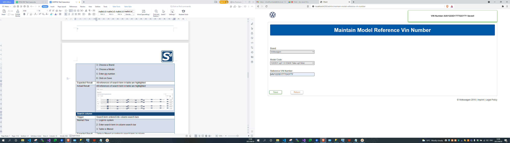
</td>
</tr>
</tbody>
</table>

## Maintain Service

<table>
<thead>
<tr class="header">
<th><strong>Save maintain service</strong></th>
<th></th>
</tr>
</thead>
<tbody>
<tr class="odd">
<td><strong>Trigger</strong></td>
<td><strong>Navigate to Maintain Service data for a Model.</strong></td>
</tr>
<tr class="even">
<td><strong>Normal Flow</strong></td>
<td><ol type="1">
<li>
Click on “Maintain Service Data for a Model” button.
</li>
<li>
Select a Brand.
</li>
<li>
Select a Model.
</li>
<li>
Choose the delivery date.
</li>
<li>
Select Start Mileage.
</li>
<li>
Select End Mileage.
</li>
<li>
Select Lifespan.
</li>
<li>
Click “Save”.
</li>
</ol></td>
</tr>
<tr class="odd">
<td><strong>Expected Result</strong></td>
<td><strong>The service data for that Vin is updated.</strong></td>
</tr>
<tr class="even">
<td><strong>Actual Result</strong></td>
<td>
The service data for that Vin is updated.

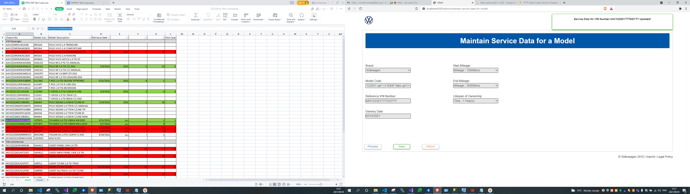
</td>
</tr>
<tr class="odd">
<td><strong>Process Vin</strong></td>
<td></td>
</tr>
<tr class="even">
<td><strong>Trigger</strong></td>
<td><strong>“Process” Button clicked</strong></td>
</tr>
<tr class="odd">
<td><strong>Normal Flow</strong></td>
<td><ol start="9" type="1">
<li>
Click on “Maintain Service Data for a Model” button.
</li>
<li>
Select a Brand.
</li>
<li>
Select a Model.
</li>
<li>
Click “Process”.
</li>
</ol></td>
</tr>
<tr class="even">
<td><strong>Expected Result</strong></td>
<td>
<strong>- The data is populated with the saved data.</strong>

<strong>- Pat response processed. 
- Pat intervals are processed.</strong>

<strong>- PPSO is processed.</strong>
</td>
</tr>
<tr class="odd">
<td><strong>Actual Result</strong></td>
<td>
<strong>- The data is populated with the saved data.</strong>

<strong>- Pat response processed. 
- Pat intervals are processed.</strong>

<strong>- PPSO is processed.</strong>

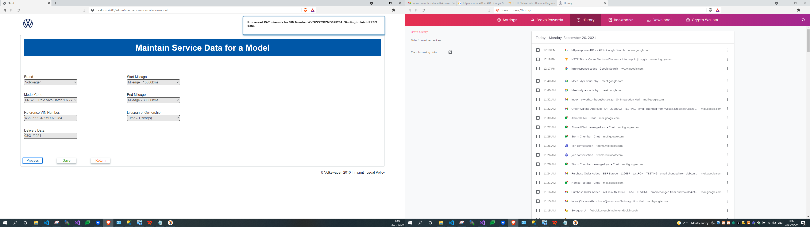

</td>
</tr>
</tbody>
</table>

## Delete Maintain Model Service Data

<table>
<thead>
<tr class="header">
<th><strong>Delete Service Data for a Model</strong></th>
<th></th>
</tr>
</thead>
<tbody>
<tr class="odd">
<td><strong>Trigger</strong></td>
<td><strong>Navigate to Delete Service Data for a Model on Administrator menu.</strong></td>
</tr>
<tr class="even">
<td><strong>Normal Flow</strong></td>
<td><ol start="6" type="1">
<li>
Click the “Delete Service Data for a Model” button.
</li>
<li>
Choose a Brand.
</li>
<li>
Choose a Model.
</li>
<li>
The Vin should fill in the box if that model has a Vin.
</li>
<li>
Click on Delete.
</li>
</ol></td>
</tr>
<tr class="odd">
<td><strong>Expected Result</strong></td>
<td><strong>The Vin will appear and the system returns a response to indicate the Vin is deleted.</strong></td>
</tr>
<tr class="even">
<td><strong>Actual Result</strong></td>
<td>
The Vin appears for system returns a response that the Vin is deleted.

</td>
</tr>
</tbody>
</table>

## User Fleet Menu

<table>
<thead>
<tr class="header">
<th><strong>User Fleet Menu</strong></th>
<th></th>
</tr>
</thead>
<tbody>
<tr class="odd">
<td><strong>Trigger</strong></td>
<td><strong>User fleet menu</strong></td>
</tr>
<tr class="even">
<td><strong>Normal Flow</strong></td>
<td><ol type="1">
<li>
The user should be logged in on the Sharepoint site.
</li>
<li>
Click on the URL for the application.
</li>
</ol></td>
</tr>
<tr class="odd">
<td><strong>Expected Result</strong></td>
<td>
<strong>- The application automatically validates the fleet user.</strong>

<strong>- The application automatically redirects the fleet user to the fleet user menu.</strong>
</td>
</tr>
<tr class="even">
<td><strong>Actual Result</strong></td>
<td>
<strong>- The application automatically validates the fleet user.</strong>

<strong>- The application automatically redirects the fleet user to the fleet user menu.</strong>

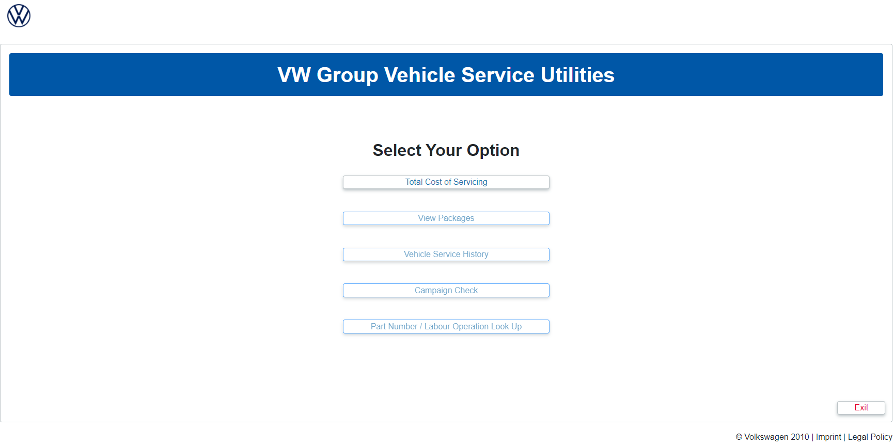
</td>
</tr>
</tbody>
</table>

## Total Cost of Servicing

<table>
<thead>
<tr class="header">
<th><strong>Total cost of Servicing (Mileage)</strong></th>
<th></th>
</tr>
</thead>
<tbody>
<tr class="odd">
<td><strong>Trigger</strong></td>
<td><strong>Total cost of servicing a Vehicle in mileages.</strong></td>
</tr>
<tr class="even">
<td><strong>Normal Flow</strong></td>
<td><ol type="1">
<li>
Click the “Total Cost of Servicing” button.
</li>
<li>
From the pop up click the “Mileage” button.
</li>
<li>
Select Volkswagen Brand.
</li>
<li>
Select Select any Model.
</li>
<li>
Select All Mileage.
</li>
</ol></td>
</tr>
<tr class="odd">
<td><strong>Expected Result</strong></td>
<td>
<strong>- The Total cost of servicing a vehicle screen appears.</strong>

<strong>- A list of the total cost of servicing a vehicle for different mileages, with parts, part number, description, time unit, quantity and price appears.</strong>
</td>
</tr>
<tr class="even">
<td><strong>Actual Result</strong></td>
<td>
<strong>- The Total cost of servicing a vehicle screen appears.</strong>

<strong>- A list of the total cost of servicing a vehicle for different mileages, with parts, part number, description, time unit, quantity and price appears.</strong>

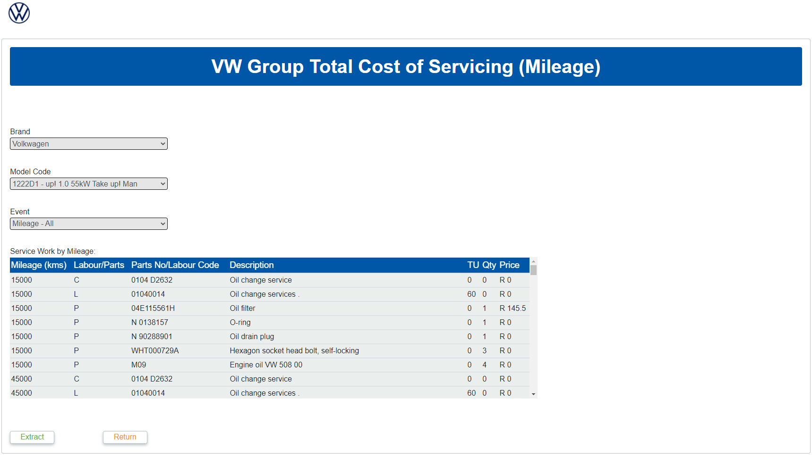
</td>
</tr>
<tr class="odd">
<td><strong>Extracting the total cost of servicing table.</strong></td>
<td></td>
</tr>
<tr class="even">
<td><strong>Trigger</strong></td>
<td><strong>Extracting the total cost of servicing a vehicle information.</strong></td>
</tr>
<tr class="odd">
<td><strong>Normal Flow</strong></td>
<td><ol start="6" type="1">
<li>
Click the “Extract” button.
</li>
<li>
From the menu select Excel button.
</li>
<li>
Click the “Save” button.
</li>
</ol></td>
</tr>
<tr class="even">
<td><strong>Expected Result</strong></td>
<td><strong>An excel document is automatically downloaded.</strong></td>
</tr>
<tr class="odd">
<td><strong>Actual Result</strong></td>
<td><strong>An excel document is automatically downloaded.</strong></td>
</tr>
</tbody>
</table>

<table>
<thead>
<tr class="header">
<th><strong>Total cost of Servicing (Time)</strong></th>
<th></th>
</tr>
</thead>
<tbody>
<tr class="odd">
<td><strong>Trigger</strong></td>
<td><strong>Total cost of servicing a Vehicle in Time.</strong></td>
</tr>
<tr class="even">
<td><strong>Normal Flow</strong></td>
<td><ol type="1">
<li>
Click the “Total Cost of Servicing” button.
</li>
<li>
From the pop up click the “Mileage” button.
</li>
<li>
Select Volkswagen Brand.
</li>
<li>
Select Select any Model.
</li>
<li>
Select All Mileage.
</li>
</ol></td>
</tr>
<tr class="odd">
<td><strong>Expected Result</strong></td>
<td>
<strong>- The Total cost of servicing a vehicle screen appears.</strong>

<strong>- A list of the total cost of servicing a vehicle for different times in months, with parts, part number, description, time unit, quantity and price appears.</strong>
</td>
</tr>
<tr class="even">
<td><strong>Actual Result</strong></td>
<td>
<strong>- The Total cost of servicing a vehicle screen appears.</strong>

<strong>- A list of the total cost of servicing a vehicle for different times in months, with parts, part number, description, time unit, quantity and price appears.</strong>

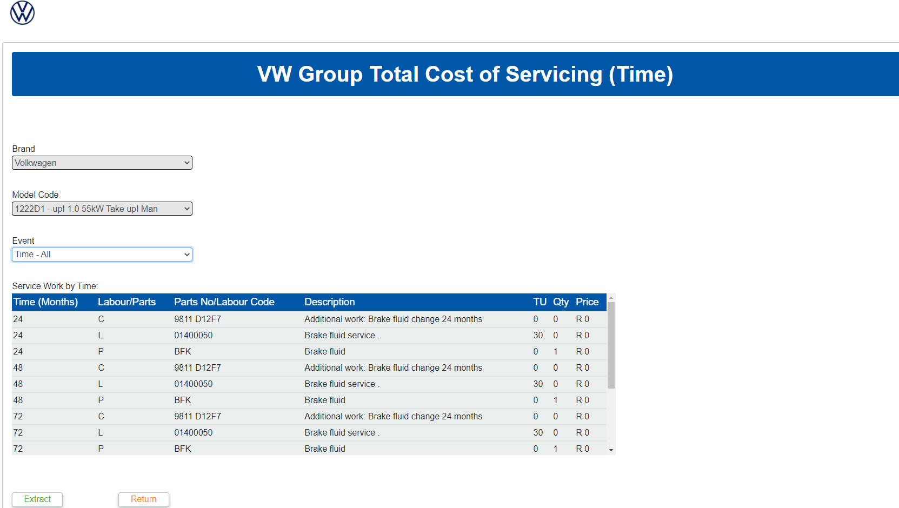
</td>
</tr>
</tbody>
</table>

<table>
<thead>
<tr class="header">
<th><strong>Hrs Column</strong></th>
<th></th>
</tr>
</thead>
<tbody>
<tr class="odd">
<td><strong>Trigger</strong></td>
<td><strong>Event is selected on TCOS screen</strong></td>
</tr>
<tr class="even">
<td><strong>Normal Flow</strong></td>
<td><ol type="1">
<li>
On the Fleet Portal, navigate to the Total Cost of Servicing screen
</li>
<li>
Click “OK” on the popup that appears
</li>
<li>
Select a Brand
</li>
<li>
Select a Model Code that has service data linked to it
</li>
<li>
Select “Mileage - All” for the Event
</li>
</ol></td>
</tr>
<tr class="odd">
<td><strong>Expected Result</strong></td>
<td><strong>“Hrs” column visible in table with relevant conversion</strong></td>
</tr>
<tr class="even">
<td><strong>Actual Result</strong></td>
<td>
<strong>Pass</strong>

</td>
</tr>
</tbody>
</table>

## View Packages

<table>
<thead>
<tr class="header">
<th><strong>View Packages</strong></th>
<th></th>
</tr>
</thead>
<tbody>
<tr class="odd">
<td><strong>Trigger</strong></td>
<td><strong>View Packages</strong></td>
</tr>
<tr class="even">
<td><strong>Normal Flow</strong></td>
<td><ol type="1">
<li>
Click the “View Packages” button.
</li>
<li>
Select Volkswagen Brand.
</li>
<li>
Select Select any Model.
</li>
<li>
Click “Load” button.
</li>
<li>
Select Package Category provided in drop down.
</li>
<li>
Select Package Sub Category provided in drop down.
</li>
</ol></td>
</tr>
<tr class="odd">
<td><strong>Expected Result</strong></td>
<td>
<strong>- View package data of a package should appear.</strong>

<strong>- A list of the view package data of a VIN, with type, package number, description, time unit, quantity.</strong>
</td>
</tr>
<tr class="even">
<td><strong>Actual Result</strong></td>
<td>
<strong>- View package data of a package appears.</strong>

<strong>- A list of the view package data of a VIN, with type, package number, description, time unit, quantity.</strong>

</td>
</tr>
</tbody>
</table>

<table>
<thead>
<tr class="header">
<th><strong>Extracting View Packages Table</strong></th>
<th></th>
</tr>
</thead>
<tbody>
<tr class="odd">
<td><strong>Trigger</strong></td>
<td><strong>Extracting the total cost of servicing a vehicle information.</strong></td>
</tr>
<tr class="even">
<td><strong>Normal Flow</strong></td>
<td><ol start="7" type="1">
<li>
Click the “Extract” button.
</li>
<li>
From the menu select Excel button.
</li>
</ol>
<ol start="9" type="1">
<li>
Click the “Save” button.
</li>
</ol></td>
</tr>
<tr class="odd">
<td><strong>Expected Result</strong></td>
<td><strong>An excel document is automatically downloaded.</strong></td>
</tr>
<tr class="even">
<td><strong>Actual Result</strong></td>
<td><strong>An excel document is automatically downloaded.</strong></td>
</tr>
</tbody>
</table>

## Vehicle Service History

<table>
<thead>
<tr class="header">
<th><strong>Vehicle Service History</strong></th>
<th></th>
</tr>
</thead>
<tbody>
<tr class="odd">
<td><strong>Trigger</strong></td>
<td><strong>Vehicle Service History</strong></td>
</tr>
<tr class="even">
<td><strong>Normal Flow</strong></td>
<td><ol type="1">
<li>
Click the Vehicle Service History Button
</li>
<li>
Enter VIN
</li>
<li>
Click the Check Button
</li>
</ol></td>
</tr>
<tr class="odd">
<td><strong>Expected Result</strong></td>
<td>
<strong>- Vehicle Service History should appear.</strong>

<strong>- A list of the vehicle service history data of a VIN, service date, mileage, type, description, time unit and quantity.</strong>
</td>
</tr>
<tr class="even">
<td><strong>Actual Result</strong></td>
<td>
<strong>- Vehicle Service History appears.</strong>

<strong>- A list of the vehicle service history data of a VIN, service date, mileage, type, description, time unit and quantity.</strong>
</td>
</tr>
<tr class="odd">
<td><strong>Extracting View Packages Table</strong></td>
<td></td>
</tr>
<tr class="even">
<td><strong>Trigger</strong></td>
<td><strong>Extracting the vehicle service history.</strong></td>
</tr>
<tr class="odd">
<td><strong>Normal Flow</strong></td>
<td><ol type="1">
<li>
On the Fleet Portal, navigate to the Vehicle Service History screen
</li>
<li>
Enter a valid VIN number
</li>
<li>
Click the “Check” button
</li>
<li>
Click the “Extract” button
</li>
<li>
Click either of the buttons in the popup that appears
</li>
</ol></td>
</tr>
<tr class="even">
<td><strong>Expected Result</strong></td>
<td><strong>An excel document is automatically downloaded.</strong></td>
</tr>
<tr class="odd">
<td><strong>Actual Result</strong></td>
<td><strong>An excel document is automatically downloaded.</strong></td>
</tr>
</tbody>
</table>

## Check Campaigns

<table>
<thead>
<tr class="header">
<th><strong>Check Campaigns</strong></th>
<th></th>
</tr>
</thead>
<tbody>
<tr class="odd">
<td><strong>Trigger</strong></td>
<td><strong>Check Campaigns</strong></td>
</tr>
<tr class="even">
<td><strong>Normal Flow</strong></td>
<td><ol type="1">
<li>
Click on the Check Campaigns Button
</li>
<li>
Enter a valid VIN in the text box
</li>
<li>
Click the Check button
</li>
</ol></td>
</tr>
<tr class="odd">
<td><strong>Expected Result</strong></td>
<td><strong>-Information as to whether there is a campaign available or not should appear</strong></td>
</tr>
<tr class="even">
<td><strong>Actual Result</strong></td>
<td>
-Information as to whether there is a campaign available or not appears

</td>
</tr>
</tbody>
</table>

## Part Number Look Up

<table>
<thead>
<tr class="header">
<th><strong>Part Number Look Up</strong></th>
<th></th>
</tr>
</thead>
<tbody>
<tr class="odd">
<td><strong>Trigger</strong></td>
<td><strong>Part Number Look Up</strong></td>
</tr>
<tr class="even">
<td><strong>Normal Flow</strong></td>
<td><ol type="1">
<li>
Click on part number look up button
</li>
<li>
Enter part number or super seeded part number
</li>
<li>
Click price
</li>
</ol></td>
</tr>
<tr class="odd">
<td><strong>Expected Result</strong></td>
<td><strong>-Information on the specified part number should appear</strong></td>
</tr>
<tr class="even">
<td><strong>Actual Result</strong></td>
<td>
-<strong>Information on the specified part number appears</strong>

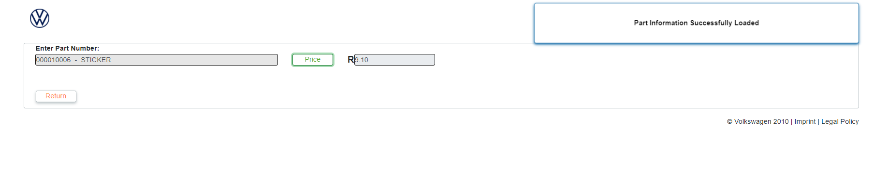
</td>
</tr>
</tbody>
</table>

## Crafter Service Intervals

<table>
<thead>
<tr class="header">
<th><strong>View Total Cost of Servicing</strong></th>
<th></th>
</tr>
</thead>
<tbody>
<tr class="odd">
<td><strong>Trigger</strong></td>
<td><strong>Crafter Model Code selected.</strong></td>
</tr>
<tr class="even">
<td><strong>Normal Flow</strong></td>
<td><ol type="1">
<li>
On the Fleet portal, navigate to the “Total Cost of Servicing”
</li>
<li>
Select a Brand
</li>
<li>
Select a Model Code that belongs to a crafter (As defined on Maintain Service Intervals screen)
</li>
</ol></td>
</tr>
<tr class="odd">
<td><strong>Expected Result</strong></td>
<td><strong>Mileages in dropdown are displayed in an interval defined on</strong> Maintain Service Intervals screen (e.g. 20000)</td>
</tr>
<tr class="even">
<td><strong>Actual Result</strong></td>
<td>
<strong>Mileages in dropdown are displayed in an interval defined on</strong> Maintain Service Intervals screen (e.g. 20000)

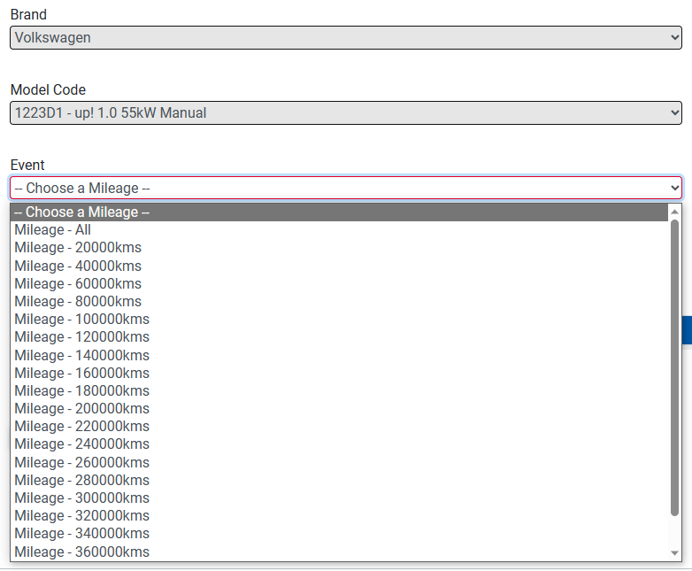
</td>
</tr>
</tbody>
</table>

<table>
<thead>
<tr class="header">
<th><strong>Maintain Service Data for Model</strong></th>
<th></th>
</tr>
</thead>
<tbody>
<tr class="odd">
<td><strong>Trigger</strong></td>
<td><strong>Packages are saved on Maintain Service Data for a Model (PPSO) screen.</strong></td>
</tr>
<tr class="even">
<td><strong>Normal Flow</strong></td>
<td><ol type="1">
<li>
On the Admin Portal, navigate to <strong>Maintain Service Data for a Model (PPSO) screen.</strong>
</li>
<li>
Select a Brand
</li>
<li>
Select a Model Code that belongs to a crafter (As defined on Maintain Service Intervals screen)
</li>
<li>
Select “Mileage” for Event Type
</li>
<li>
Select a Package Category
</li>
<li>
Drag a package from the left to the right
</li>
<li>
Click “Save” button at bottom of the page
</li>
</ol></td>
</tr>
<tr class="odd">
<td><strong>Expected Result</strong></td>
<td><strong>Mileages in popup are displayed in an interval defined on</strong> Maintain Service Intervals screen (e.g. 20000)</td>
</tr>
<tr class="even">
<td><strong>Actual Result</strong></td>
<td>
<strong>Pass</strong>

</td>
</tr>
</tbody>
</table>

## Crafter Service Intervals

<table>
<thead>
<tr class="header">
<th><strong>Create Service Interval entry</strong></th>
<th></th>
</tr>
</thead>
<tbody>
<tr class="odd">
<td><strong>Trigger</strong></td>
<td><strong>User adds a new Service Interval</strong></td>
</tr>
<tr class="even">
<td><strong>Normal Flow</strong></td>
<td><ol type="1">
<li>
On the Admin Portal, navigate to <strong>Maintain Service Intervals screen</strong>
</li>
<li>
Click on the “+” button to the top right of the datagrid
</li>
<li>
Select a Model Code
</li>
<li>
Enter an interval
</li>
<li>
Click the “Save” button 
</li>
</ol></td>
</tr>
<tr class="odd">
<td><strong>Expected Result</strong></td>
<td><strong>A new Service Interval is saved for the Model Code</strong></td>
</tr>
<tr class="even">
<td><strong>Actual Result</strong></td>
<td>
<strong>Pass</strong>

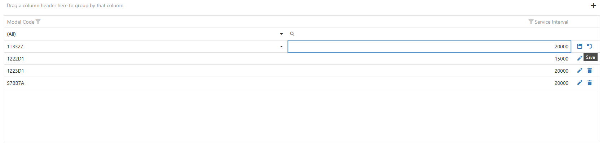

</td>
</tr>
</tbody>
</table>

<table>
<thead>
<tr class="header">
<th><strong>View Service Interval entries</strong></th>
<th></th>
</tr>
</thead>
<tbody>
<tr class="odd">
<td><strong>Trigger</strong></td>
<td><strong>User navigates to Maintain Service Intervals screen</strong></td>
</tr>
<tr class="even">
<td><strong>Normal Flow</strong></td>
<td><ol type="1">
<li>
On the Admin Portal, navigate to <strong>Maintain Service Intervals screen</strong>
</li>
</ol></td>
</tr>
<tr class="odd">
<td><strong>Expected Result</strong></td>
<td><strong>Existing Service Intervals are displayed</strong></td>
</tr>
<tr class="even">
<td><strong>Actual Result</strong></td>
<td>
<strong>Pass</strong>

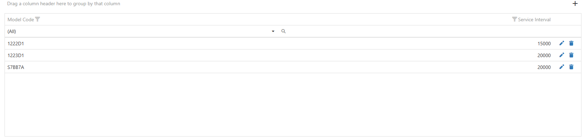
</td>
</tr>
</tbody>
</table>

<table>
<thead>
<tr class="header">
<th><strong>Update Service Interval entry</strong></th>
<th></th>
</tr>
</thead>
<tbody>
<tr class="odd">
<td><strong>Trigger</strong></td>
<td><strong>User updates an existing Service Interval</strong></td>
</tr>
<tr class="even">
<td><strong>Normal Flow</strong></td>
<td><ol type="1">
<li>
On the Admin Portal, navigate to <strong>Maintain Service Intervals screen</strong>
</li>
<li>
Click on the “Edit”  button to the right of the desired row
</li>
<li>
Make any relevant edits to the data
</li>
<li>
Click the “Save”  button
</li>
</ol></td>
</tr>
<tr class="odd">
<td><strong>Expected Result</strong></td>
<td><strong>Service Interval entry is updated</strong></td>
</tr>
<tr class="even">
<td><strong>Actual Result</strong></td>
<td>
<strong>Pass</strong>

</td>
</tr>
</tbody>
</table>

<table>
<thead>
<tr class="header">
<th><strong>Delete Service Interval entry</strong></th>
<th></th>
</tr>
</thead>
<tbody>
<tr class="odd">
<td><strong>Trigger</strong></td>
<td><strong>User clicks “Delete”</strong>  <strong>button</strong></td>
</tr>
<tr class="even">
<td><strong>Normal Flow</strong></td>
<td><ol type="1">
<li>
On the Admin Portal, navigate to <strong>Maintain Service Intervals screen</strong>
</li>
<li>
Click on the “Delete”  button to the right of the desired row
</li>
<li>
Click “Yes” on the popup that appears
</li>
</ol></td>
</tr>
<tr class="odd">
<td><strong>Expected Result</strong></td>
<td><strong>Service Interval entry is deleted</strong></td>
</tr>
<tr class="even">
<td><strong>Actual Result</strong></td>
<td>
<strong>Pass</strong>

</td>
</tr>
</tbody>
</table>

## Fluid Mapping

<table>
<thead>
<tr class="header">
<th><strong>Create Fluid Mapping Entry</strong></th>
<th></th>
</tr>
</thead>
<tbody>
<tr class="odd">
<td><strong>Trigger</strong></td>
<td><strong>User clicks “+” button on Fluid Mapping component</strong></td>
</tr>
<tr class="even">
<td><strong>Normal Flow</strong></td>
<td><ol type="1">
<li>
On the Admin Portal, navigate to the “Maintain Fluid Mapping Table” component
</li>
<li>
Click the “+” button to the top right of the datagrid
</li>
<li>
Enter a Pseudo Code for a fluid part
</li>
<li>
Enter a Part Number that will replace the Pseudo Code
</li>
<li>
Enter a Part Description
</li>
<li>
Click the “Save”  button
</li>
</ol></td>
</tr>
<tr class="odd">
<td><strong>Expected Result</strong></td>
<td><strong>A New Fluid Mapping entry is created.</strong></td>
</tr>
<tr class="even">
<td><strong>Actual Result</strong></td>
<td>
<strong>Pass</strong>

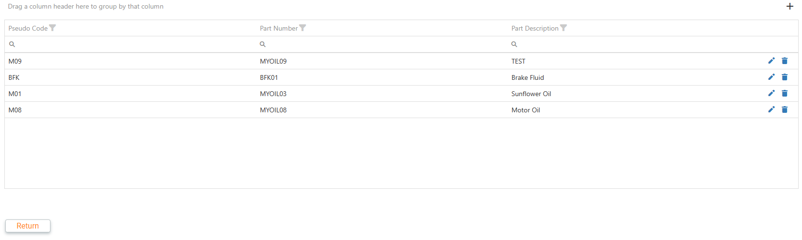
</td>
</tr>
</tbody>
</table>

<table>
<thead>
<tr class="header">
<th><strong>View Fluid Mapping Entries</strong></th>
<th></th>
</tr>
</thead>
<tbody>
<tr class="odd">
<td><strong>Trigger</strong></td>
<td><strong>User navigates to the “Maintain Fluid Mapping Table” screen</strong></td>
</tr>
<tr class="even">
<td><strong>Normal Flow</strong></td>
<td><ol type="1">
<li>
On the Admin Portal, navigate to the “Maintain Fluid Mapping Table” screen
</li>
</ol></td>
</tr>
<tr class="odd">
<td><strong>Expected Result</strong></td>
<td><strong>Existing Fluid Mappings are displayed</strong></td>
</tr>
<tr class="even">
<td><strong>Actual Result</strong></td>
<td>
<strong>Pass</strong>

</td>
</tr>
</tbody>
</table>

<table>
<thead>
<tr class="header">
<th><strong>Update Fluid Mapping Entry</strong></th>
<th></th>
</tr>
</thead>
<tbody>
<tr class="odd">
<td><strong>Trigger</strong></td>
<td><strong>User edits an existing Fluid Mapping entry</strong></td>
</tr>
<tr class="even">
<td><strong>Normal Flow</strong></td>
<td><ol type="1">
<li>
On the Admin Portal, navigate to the “Maintain Fluid Mapping Table” component
</li>
<li>
Click on the Edit  button to the right of the desired row
</li>
<li>
Make any relevant edits to the data
</li>
<li>
Click the “Save”  button
</li>
</ol></td>
</tr>
<tr class="odd">
<td><strong>Expected Result</strong></td>
<td><strong>Fluid Mapping entry is updated</strong></td>
</tr>
<tr class="even">
<td><strong>Actual Result</strong></td>
<td>
<strong>Pass</strong>

</td>
</tr>
</tbody>
</table>

<table>
<thead>
<tr class="header">
<th><strong>Delete Fluid Mapping Entry</strong></th>
<th></th>
</tr>
</thead>
<tbody>
<tr class="odd">
<td><strong>Trigger</strong></td>
<td><strong>User clicks “Delete”</strong>  <strong>button</strong></td>
</tr>
<tr class="even">
<td><strong>Normal Flow</strong></td>
<td><ol type="1">
<li>
On the Admin Portal, navigate to <strong>Maintain Fluid Mapping Table screen</strong>
</li>
<li>
Click on the “Delete”  button to the right of the desired row
</li>
<li>
Click “Yes” on the popup that appears
</li>
</ol></td>
</tr>
<tr class="odd">
<td><strong>Expected Result</strong></td>
<td><strong>Fluid Mapping entry is deleted</strong></td>
</tr>
<tr class="even">
<td><strong>Actual Result</strong></td>
<td>
<strong>Pass</strong>

</td>
</tr>
</tbody>
</table>

<table>
<thead>
<tr class="header">
<th><strong>View Total Cost of Servicing</strong></th>
<th></th>
</tr>
</thead>
<tbody>
<tr class="odd">
<td><strong>Trigger</strong></td>
<td><strong>User selects an Event on the “Total Cost of Servicing” screen</strong></td>
</tr>
<tr class="even">
<td><strong>Normal Flow</strong></td>
<td><ol type="1">
<li>
On the Fleet Portal, navigate to the “<strong>Total Cost of Servicing” screen</strong>
</li>
<li>
Select Brand
</li>
<li>
Select a Model that has a Service with Fluid Parts (e.g. Oil Change Service)
</li>
<li>
Select “Mileage - All” in the Event dropdown
</li>
</ol></td>
</tr>
<tr class="odd">
<td><strong>Expected Result</strong></td>
<td><strong>Pseudo Code in “Parts No/Labour Code” column is replaced with the mapped Part Number from the Fluid Mapping table</strong></td>
</tr>
<tr class="even">
<td><strong>Actual Result</strong></td>
<td>
<strong>Pass</strong>

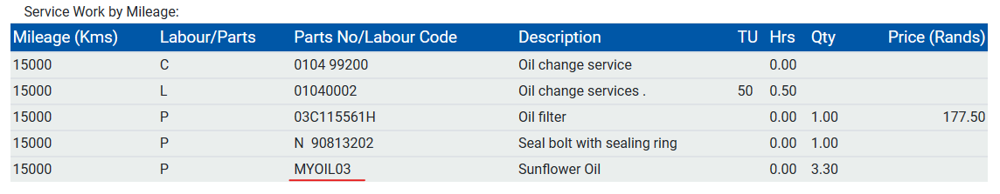
</td>
</tr>
</tbody>
</table>

<table>
<thead>
<tr class="header">
<th><strong>View Packages</strong></th>
<th></th>
</tr>
</thead>
<tbody>
<tr class="odd">
<td><strong>Trigger</strong></td>
<td><strong>User selects an Event on the View Packages screen</strong></td>
</tr>
<tr class="even">
<td><strong>Normal Flow</strong></td>
<td><ol type="1">
<li>
On the Fleet Portal, navigate to the “<strong>View Packages” screen</strong>
</li>
<li>
Select Brand
</li>
<li>
Select a Model Code or Enter a VIN
</li>
<li>
Click the “Load” button
</li>
<li>
Select a Package Category (e.g. Inspection Services)
</li>
<li>
Select a Package that has fluid part numbers (e.g. Oil Change Service)
</li>
</ol></td>
</tr>
<tr class="odd">
<td><strong>Expected Result</strong></td>
<td><strong>Pseudo Code in “Number” column is replaced with the mapped Part Number from the Fluid Mapping table</strong></td>
</tr>
<tr class="even">
<td><strong>Actual Result</strong></td>
<td>
<strong>Pass</strong>

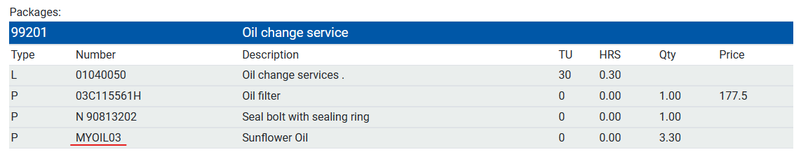
</td>
</tr>
</tbody>
</table>

## Usage Reports for Business

<table>
<thead>
<tr class="header">
<th><strong>View Usage Reports</strong></th>
<th></th>
</tr>
</thead>
<tbody>
<tr class="odd">
<td><strong>Trigger</strong></td>
<td><strong>User navigates to the “View Usage Reports” screen</strong></td>
</tr>
<tr class="even">
<td><strong>Normal Flow</strong></td>
<td><ol type="1">
<li>
On the Admin Portal, navigate to the “View usage Reports” <strong>screen</strong>
</li>
</ol></td>
</tr>
<tr class="odd">
<td><strong>Expected Result</strong></td>
<td><strong>Usage Reports from database displayed in datagrid</strong></td>
</tr>
<tr class="even">
<td><strong>Actual Result</strong></td>
<td>
<strong>Pass</strong>

</td>
</tr>
</tbody>
</table>

## Manual Data Maintenance

<table>
<thead>
<tr class="header">
<th><strong>Create Manual Service Data for Model Code</strong></th>
<th></th>
</tr>
</thead>
<tbody>
<tr class="odd">
<td><strong>Trigger</strong></td>
<td><strong>User Navigates to “Maintain Service Data for a Model (PPSO)” screen and completes the form</strong></td>
</tr>
<tr class="even">
<td><strong>Normal Flow</strong></td>
<td><ol type="1">
<li>
On the Admin Portal, navigate to the <strong>Maintain Service Data for a Model (PPSO) screen.</strong>
</li>
<li>
Select a Brand
</li>
<li>
Select a Model Code
</li>
<li>
Select an Event Type
</li>
<li>
Select a Package Category
</li>
<li>
Drag desired packages from the left list to the right list
</li>
<li>
Click Save
</li>
<li>
On the popup that appears, select the mileages the packages should be copied to
</li>
<li>
Click the “Continue” button
</li>
</ol></td>
</tr>
<tr class="odd">
<td><strong>Expected Result</strong></td>
<td><strong>Total Cost of Servicing now includes added packages’ parts</strong></td>
</tr>
<tr class="even">
<td><strong>Actual Result</strong></td>
<td>
<strong>Pass</strong>

</td>
</tr>
</tbody>
</table>

<table>
<thead>
<tr class="header">
<th><strong>Delete Manual Service Data For Model Code</strong></th>
<th></th>
</tr>
</thead>
<tbody>
<tr class="odd">
<td><strong>Trigger</strong></td>
<td><strong>User clicks “Delete” on</strong> the “<strong>Maintain Service Data for a Model (PPSO)” screen</strong></td>
</tr>
<tr class="even">
<td><strong>Normal Flow</strong></td>
<td><ol type="1">
<li>
On the Admin Portal, navigate to the “<strong>Maintain Service Data for a Model (PPSO)” screen.</strong>
</li>
<li>
Select a Brand
</li>
<li>
Select a Model Code
</li>
<li>
Click the “Delete” button
</li>
<li>
On the popup that appears, click “Delete”
</li>
</ol></td>
</tr>
<tr class="odd">
<td><strong>Expected Result</strong></td>
<td><strong>Total Cost of Servicing no longer includes added packages’ parts</strong></td>
</tr>
<tr class="even">
<td><strong>Actual Result</strong></td>
<td>
<strong>Pass</strong>

</td>
</tr>
</tbody>
</table>

## Implementation of Swagger Authentication

<table>
<thead>
<tr class="header">
<th><strong>Authenticate Swagger Portal</strong></th>
<th></th>
</tr>
</thead>
<tbody>
<tr class="odd">
<td><strong>Trigger</strong></td>
<td><strong>User logs in to Swagger Portal for the PPSOSM backend</strong></td>
</tr>
<tr class="even">
<td><strong>Normal Flow</strong></td>
<td><ol type="1">
<li>
Navigate to backend Swagger Portal
</li>
<li>
Click on the “/api/Authentication/GetAuthToken” endpoint under the “Authentication” section
</li>
<li>
Click the “Try it out” button
</li>
<li>
Enter Username and Password
</li>
<li>
Click Execute
</li>
<li>
Copy token from Response Body
</li>
</ol>
<blockquote>

</blockquote>
<ol start="7" type="1">
<li>
At the top of the page, click the “Authorize” button 
</li>
<li>
Paste Token from step 6 into the “Value” field
</li>
<li>
Click “Authorize” button
</li>
<li>
Click “Close” button
</li>
</ol></td>
</tr>
<tr class="odd">
<td><strong>Expected Result</strong></td>
<td><strong>JWT token is automatically included as request header in api calls made from the Swagger Portal</strong></td>
</tr>
<tr class="even">
<td><strong>Actual Result</strong></td>
<td><strong>Pass</strong></td>
</tr>
</tbody>
</table>
